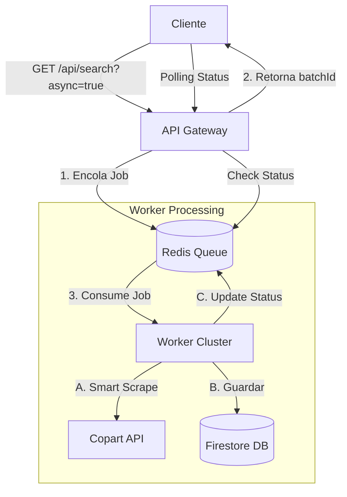

# ScraptPress v3.2 - Worker Architecture

## 🎯 **Overview**

### 1. **Worker Asíncrono** (`src/worker.ts`)
- Proceso dedicado para procesar scraping masivo en background.
- Escucha la cola Redis y ejecuta jobs usando la estrategia **Smart API Interception**.
- Concurrencia configurable (`WORKER_CONCURRENCY`) para procesar múltiples vehículos en paralelo.
- Reintentos automáticos y Graceful Shutdown.

### 2. **Job Queue Security** (`src/services/job-queue-security.service.ts`)
- **Rate Limiting:** 10 requests/minuto por IP, 100/minuto por API key.
- **Concurrent Jobs:** Máx 3 jobs simultáneos por IP, 10 por API key.
- **Validación:** Prevención de XSS e inyecciones.

### 3. **Modo Asíncrono**
- `async=true`: Encola job en Redis y retorna inmediatamente un `batchId`.
- Ideal para cargas masivas o integración con sistemas que requieren respuesta inmediata (non-blocking).

---

## 📊 **Arquitectura**



---

## 🔒 **Seguridad & Limites**

### Rate Configuration (`.env`)
```bash
RATE_LIMIT_IP=10       # Requests/min por IP
RATE_LIMIT_API_KEY=100 # Requests/min por Key
MAX_JOBS_PER_IP=3      # Jobs concurrentes
WORKER_CONCURRENCY=3   # Threads por Worker
```

### Límites de Paginación
- Max Page: 50
- Max Limit: 100 vehículos/request

---

## 🚀 **Deployment**

### Cloud Run (Workers)
Los workers se despliegan como un servicio separado "sidecar" o independiente que comparte la conexión Redis y Firestore.

```bash
# Deploy Worker
npm run deploy:worker
```

**Escalado:** 
- Scaling basado en CPU/Memoria o métricas de Redis Queue (HPA).
- Recomendado: 1-5 instancias para carga normal.

---

## 🧪 **Testing**

### Async Job Flow
1. **Encolar Job**:
   ```bash
   curl "http://localhost:3000/api/search/vehicles?query=mustang&async=true"
   # Resp: { "batchId": "job-123", "status": "queued" }
   ```

2. **Verificar Status**:
   ```bash
   curl "http://localhost:3000/api/search/status/job-123"
   # Resp: { "status": "completed", "vehicles": [...] }
   ```
